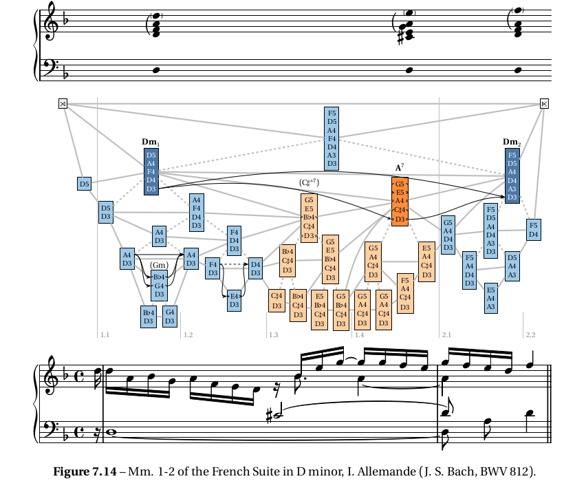
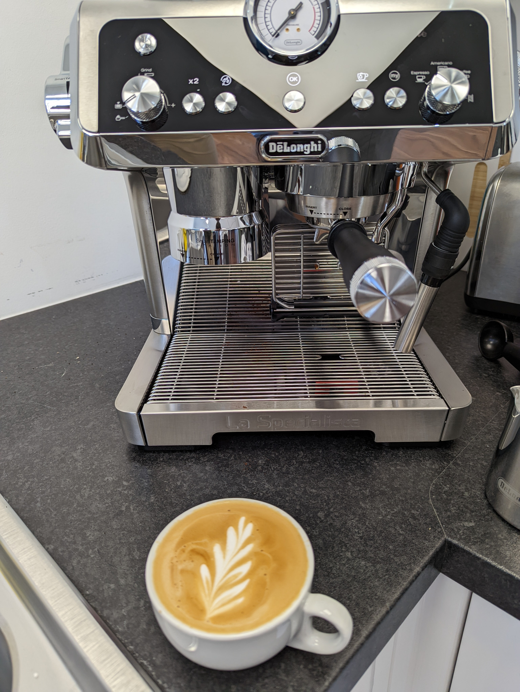
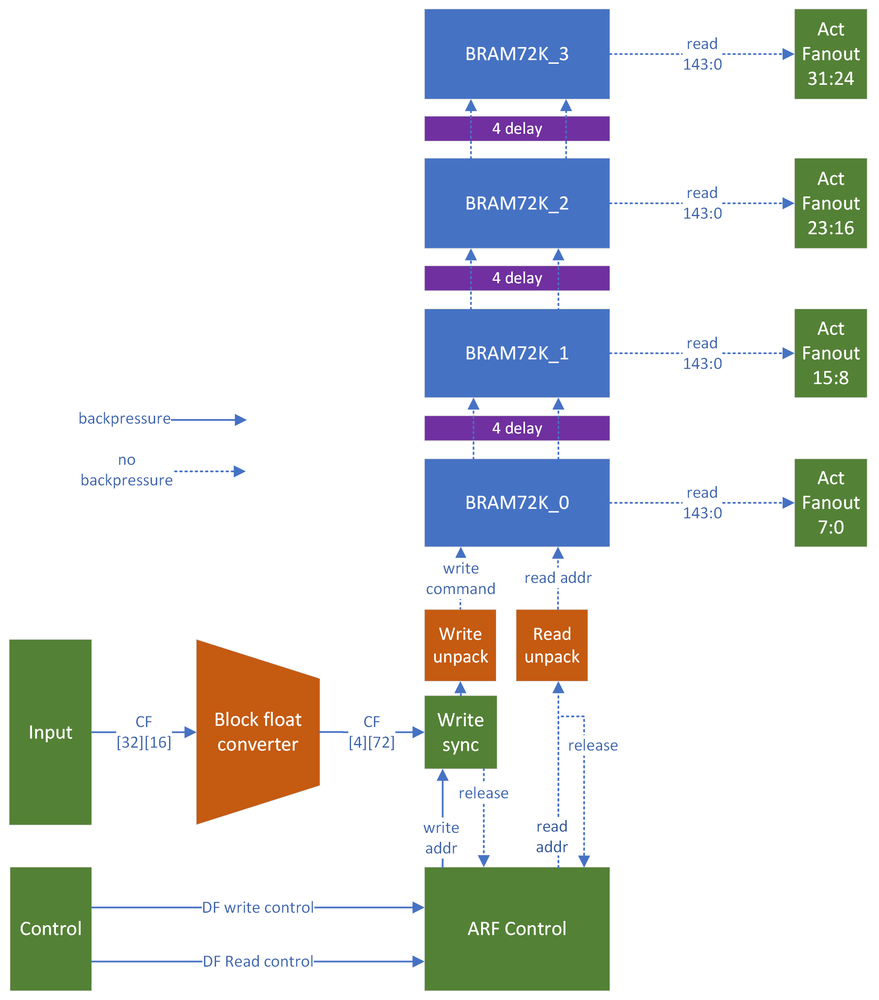
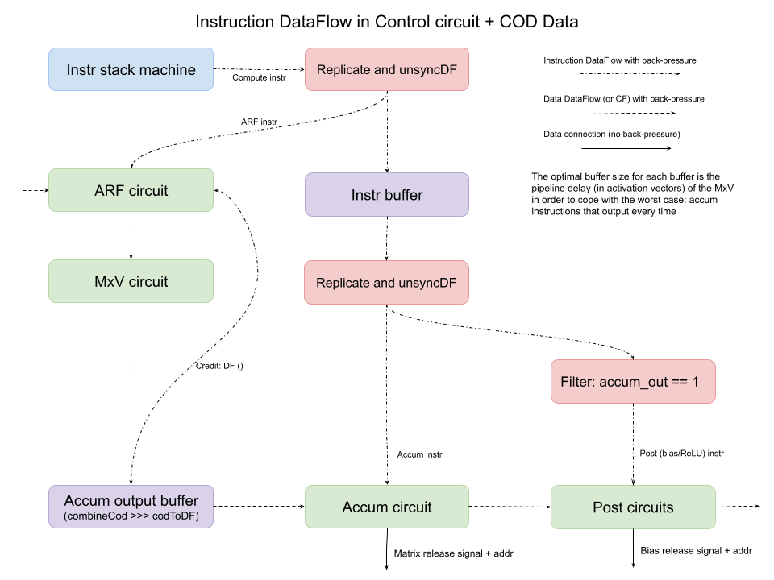

% 8 weeks in the life of a Myrtle Intern
% Judah Daniels
% Aug 17th, 2022

# Introductions

## Who am I?

- My name is Judah
- Computer Science undergrad at the Cambridge
- Feel free to interrupt and ask questions

::: notes
I'm a computer science undergrad at clare college, cambridge.
Going into my third and final year.
:::

## Contents

- Overview of my internship 
- Register Banking
- Achronix Demo
- Formal Verfication

# Overview of my internship
## Overview

- I've learnt a lot!
- I arrived with
  + No Haskell experience
  + Very little systemVerilog experience
  + No Elm experience

##

- Haskell is great!

::: notes 
Next year I will be doing my final year dissertation.
I found a body of research involving formal models of music, based upon the same Chomskyan theories that underly
a lot of the NLP.
I contacted one of the authors of the papers, and my knew found knowledge of haskell opened to door to the 
project that I will be doing next year.
:::

## 

{width=600}

::: notes
My project Which involes optimising a parser written in haskell that can interpret 
the underlying structure of a piece of music 
:::

## Supervisor

Basile Henry

{width=360}

::: notes
Fantastic Supervisor
Taught me so much
- rust
- haskell 
- clash
- git
- vim
- tmux
:::

# Espresso Machine

{width=360}

# Register Banking

## Background

Mau Achronix

Matrix-Vector multiplication

## Activation Register File

{height=500}

## Locking Mechanism
 
- Prevents data hazards
  + Ensure a register is not written to until the old data is no longer needed

## Problem

We'd like to pre-load the next activation in the register

This would save time!

Locking inhibits this :(

## Solution

## Instruction flow

{width=360}

# Polar

# Achronix Demo

<video data-autoplay autoplay muted loop src="./achronix-demo.mkv"></video>

## Elm 

# Formal Verfication

# Closing Remarks

# Questions?

::: notes
Also please feel free to come up and ask me stuff after or message me on slack, or use the getting started slack channel
:::
