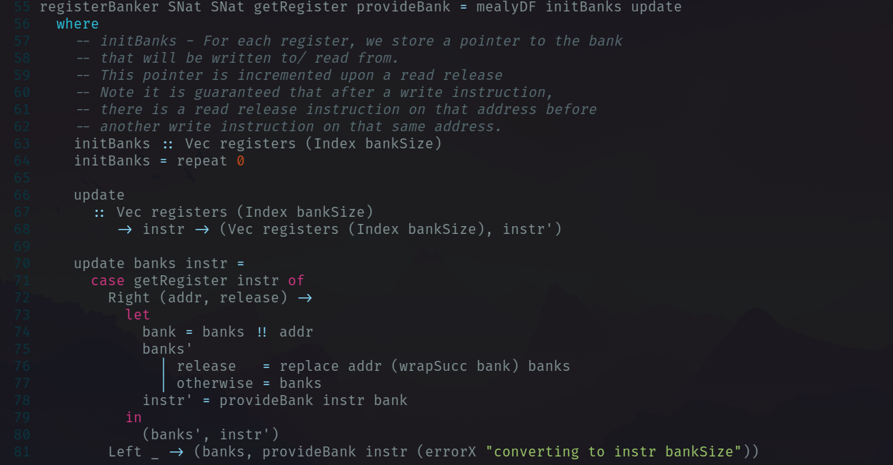

% 8 weeks in the life of a Myrtle Intern
% Judah Daniels
% Aug 17th, 2022

# Introductions

## Who am I?

- My name is Judah
- Computer Science undergrad at the Cambridge
- Feel free to interrupt and ask questions

::: notes
I'm a computer science undergrad at clare college, cambridge.
Going into my third and final year.
:::

## Contents

- Overview of my internship 
- Register Banking
- Achronix Demo
- Formal Verfication

# Overview of my internship
## Overview

- I've learnt a lot!
- I arrived with
  + No Haskell experience
  + Very little systemVerilog experience
  + No Elm experience

##

- Haskell is great!

::: notes 

Thanks to my new found love of haskell, 
:::

## 

{width=360}

## Supervisor

# Espresso Machine

{width=360}

# Register Banking

# Polar

# Achronix Demo

<video data-autoplay autoplay muted loop src="./achronix-demo.mkv"></video>

## Elm 

# Formal Verfication

# Closing Remarks

# Questions?

::: notes
Also please feel free to come up and ask me stuff after or message me on slack, or use the getting started slack channel
:::
